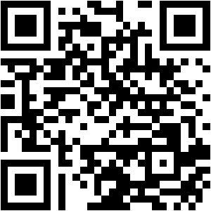

# 🚀 Nutrition Tracker Pro

<div align="center">
  
  <p><b>"Liquid Glass meets Hand-drawn Sketch"</b></p>

  [](https://reactjs.org/)
  [](https://www.typescriptlang.org/)
  [](https://fastapi.tiangolo.com/)
  [](https://tailwindcss.com/)
</div>

---

## 🎨 專案簡介 (Introduction)

**Nutrition Tracker Pro** 是一款專為追求極致美感與功能平衡的使用者設計的健康追蹤系統。本專案將前衛的 **Liquid Glass (液態玻璃)** 視覺語彙與 **手繪筆記 (Hand-drawn Sketch)** 的溫暖風格結合，創造出既專業又具有親和力的設計體驗。

### ✨ 設計核心：Klee One 手寫語法
專案全面導入了 **Klee One** 手寫字體，這是一款兼具「硬筆書法」氣息與「現代感」的字體，完美解決了繁體中文在藝術化介面中的相容性，讓每一行文字都像是您的專屬營養師親筆寫下的筆記。

---

## 🔗 快速連結 (Quick Links)

- **✨ [線上成果展示入口 (Live Demo)](https://benson927.github.io/nutrition-tracker-pro/)**
- **📄 [技術架構簡報 (Detailed Docs)](./presentation.html)**
- **🖼️ [功能截圖預覽 (UI Gallery)](./gallery.html)**

### 📱 隨身攜帶您的營養管家


---

## 🚀 開發演進歷程 (Development Journey)

本專案經歷了五個關鍵的核心階段：

1. **Phase 1: Visual Art Exploration**
   探索 3D 與慣性系統，為專案奠定高品質動態視覺基礎。
2. **Phase 2: Liquid Glass Era**
   定調深邃純黑與呼吸感光暈的玻璃擬態美學。
3. **Phase 3: Performance Pivot**
   深度優化 TDEE 計算邏輯，移除冗餘模組，提升載入速度。
4. **Phase 4: UI Refinement**
   實作 3x2 / 2x2 對稱佈局，結合純 CSS 微互動效果，達到視覺上的完美平衡。
5. **Phase 5: Digital Mascot & Typography**
   引入 **Moomin (嚕嚕咪)** 吉祥物並整合 **Klee One** 字體，完成全平台視覺的和諧對齊。

---

## 🏗️ 專案架構 (Project Architecture)

```text
.
├── frontend/           # 基於 Vite + TypeScript 的 React 前端 (Tailwind CSS v4)
├── backend/            # 基於 FastAPI 的高性能非同步後端
├── presentation/       # 根目錄下的成果展示資源
│   ├── index.html      # 展示入口 (首頁)
│   ├── gallery.html    # 產品截圖藝廊
│   └── presentation.html# 技術架構簡報
├── qrcode.png          # 線上體驗專用 QR Code
└── moomin.png          # 專案互動吉祥物
```

---

## 📚 核心資源與簡報 (Core Presentations)

專案內附三份深度簡報，分別從不同維度解析本系統的開發精髓：

- **💡 [行動平台動機與理念](./行動平台動機與理念簡報.pdf)**
  *關鍵點：產品定位、痛點分析、使用者研究與 Liquid Glass 風格的源起。*
- **⚙️ [行動平台技術概念](./行動平台技術概念簡報.pdf)**
  *關鍵點：FastAPI 架構、數據流平衡、Security 權限機制與代碼優化策略。*
- **📜 [開發過程經歷紀錄](./開發過程經歷簡報.pdf)**
  *關鍵點：詳細紀錄了五個階段的迭代過程、遇到的挑戰與最終成果導覽。*

---

## 📽️ 功能演示 (Feature Demo)

如果您想快速了解系統的操作流程，請觀看下方的實機錄影：

https://github.com/benson927/nutrition-tracker-pro/assets/行動平台影片v2.mp4

> (註：若 GitHub 預覽未正常顯示，請直接查看 [行動平台影片v2.mp4](./行動平台影片v2.mp4))

---

## 📄 授權說明 (License)

© 2026 Benson Hong. All Rights Reserved.  
Crafted with ❤️ and Liquid Glass Aesthetics.
