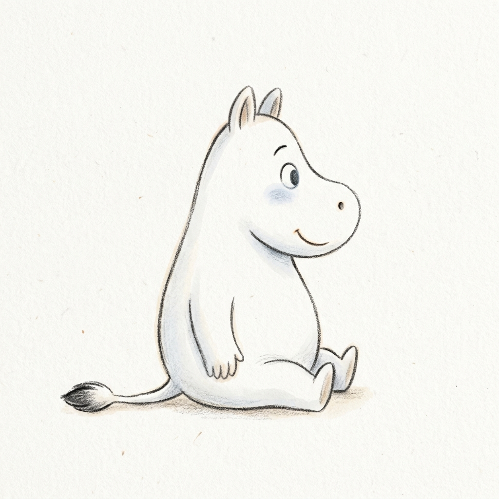

# 🚀 Nutrition Tracker Pro

<div align="center">
  
  <p><b>"Liquid Glass meets Hand-drawn Sketch • Now Powered by Cloud"</b></p>

  [](https://reactjs.org/)
  [](https://www.typescriptlang.org/)
  [](https://fastapi.tiangolo.com/)
  [](https://supabase.com/)
  [](https://www.postgresql.org/)
  [](https://render.com/)
</div>

---

## 🎨 專案簡介 (Introduction)

**Nutrition Tracker Pro** 是一款專為追求極致美感與功能平衡的使用者設計的健康追蹤系統。本專案將前衛的 **Liquid Glass (液態玻璃)** 視覺語彙與 **手繪筆記 (Hand-drawn Sketch)** 的溫暖風格結合，創造出既專業又具有親和力的設計體驗。

### ☁️ 雲端賦能 (Cloud-Powered)
目前系統已全面完成雲端遷移，不再依賴本地存儲。後端託管於 **Render**，並採用 **Supabase (PostgreSQL)** 進行全雲端數據儲存，保證您的健康數據隨時隨地保持同步。

### ✨ 設計核心：Klee One 手寫語法
專案全面導入了 **Klee One** 手寫字體，這是一款兼具「硬筆書法」氣息與「現代感」的字體，完美解決了繁體中文在藝術化介面中的相容性，讓每一行文字都像是您的專屬營養師親筆寫下的筆記。

---

## 🔗 快速連結 (Quick Links)

- **✨ [線上成果展示入口 (Live Demo)](https://benson927.github.io/nutrition-tracker-pro/)**
- **📄 [技術架構簡報 (Detailed Docs)](./presentation.html)**
- **🖼️ [功能截圖預覽 (UI Gallery)](./gallery.html)**

---

## 📢 即時意見回饋系統 (Real-time Feedback System)
系統整合了 **Discord Webhook** 服務。使用者填寫的每一份意見或疑難排解，都會即時經由 FastAPI 處理並推送至開發者的 Discord 頻道，實現無縫的開發者與使用者互動。

---

## 🚀 開發演進歷程 (Development Journey)

本專案經歷了六個關鍵的核心階段：

1. **Phase 1: Visual Art Exploration** - 探索 3D 與慣性系統。
2. **Phase 2: Liquid Glass Era** - 定調深邃純黑與呼吸感光暈的玻璃擬態美學。
3. **Phase 3: Performance Pivot** - 優化 TDEE 計算邏輯，移除冗餘模組。
4. **Phase 4: UI Refinement** - 實作 3x2 / 2x2 對稱佈局與純 CSS 微互動。
5. **Phase 5: Digital Mascot & Typography** - 整合 **Moomin** 吉祥物與 **Klee One** 字體。
6. **Phase 6: Cloud Migration & Real-time Loop** (Current) - 實現從 SQLite 到 **Cloud PostgreSQL** 的跨越，並整合即時回饋系統。

---

## 🏗️ 專案架構 (Project Architecture)

```text
.
├── frontend/           # Vite + React (Tailwind CSS v4) - 可動態感應 API 域名
├── backend/            # FastAPI + Psycopg2 (託管於 Render) - 高性能非同步後端
├── database/           # 雲端 PostgreSQL (由 Supabase 提供，支援 SSL 與 Connection Pooling)
├── presentation/       # 根目錄下的成果展示資源
└── integrations/       # Discord Webhook 通知整合
```

---

## 📚 核心資源與簡報 (Core Presentations)

專案內附三份深度簡報，分別從不同維度解析本系統的開發精髓：

- **💡 [行動平台動機與理念](./行動平台動機與理念簡報.pdf)**
  *關鍵點：產品定位、痛點分析、使用者研究與 Liquid Glass 風格的源起。*
- **⚙️ [行動平台技術概念](./行動平台技術概念簡報.pdf)**
  *關鍵點：FastAPI 架構、數據流平衡、Security 權限機制與代碼優化策略。*
- **📜 [開發過程經歷紀錄](./開發過程經歷簡報.pdf)**
  *關鍵點：詳細紀錄了五個階段的迭代過程、遇到的挑戰與最終成果導覽。*

---

## 📽️ 功能演示 (Feature Demo)

如果您想快速了解系統的操作流程，請觀看下方的實機錄影：

https://github.com/benson927/nutrition-tracker-pro/assets/行動平台影片v2.mp4

> (註：若 GitHub 預覽未正常顯示，請直接查看 [行動平台影片v2.mp4](./行動平台影片v2.mp4))

---

## 📄 授權說明 (License)

© 2026 Benson Hong. All Rights Reserved.
